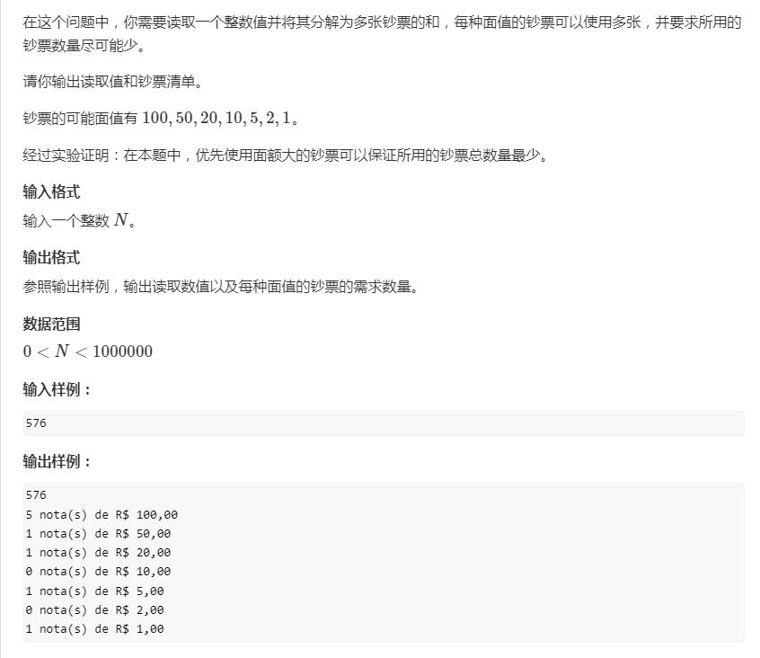

[TOC]

# 第一讲 变量、输入输出、表达式与顺序语句

## 例题
### AcWing 1. A + B 


```c++
#include<iostream>

using namespace std;

int main()
{
    int a, b;
    cin >> a >> b;
    cout << a + b << endl;
    return 0;
}
```

### AcWing 608. 差


```c++
#include<iostream>

using namespace std;

int main()
{
    int a, b, c, d;
    cin >> a >> b >> c >> d;
    cout << "DIFERENCA = " << (a * b - c * d) << endl;
    return 0;
}
```

### AcWing 604. 圆的面积


```c++
#include<iostream>

using namespace std;

const double PI = 3.14159;

int main()
{
    double r;
    cin >> r;
    printf("A=%.4lf", PI * r * r);
    return 0;
}
```

### AcWing 606. 平均数1 


```c++
#include<iostream>

using namespace std;

int main()
{
    double a, b;
    cin >> a >> b;
    printf("MEDIA = %.5lf", (a * 3.5 + b * 7.5) / 11);
    return 0;
}
```

### AcWing 609. 工资


```c++
#include<iostream>

using namespace std;

int main()
{
    int a, b;
    double c;
    cin >> a >> b >> c;
    cout << "NUMBER = " << a << endl;
    printf("SALARY = U$ %.2lf", b * c);
    return 0;
}
```

### AcWing 615. 油耗 


```c++
#include<iostream>

using namespace std;

int main()
{
    int a;
    double b;
    cin >> a >> b;
    printf("%.3lf km/l", a / b);
    return 0;
}
```

### AcWing 616. 两点间的距离


```c++
#include<iostream>
#include<cmath>

using namespace std;

int main()
{
    double x1, y1, x2, y2;
    cin >> x1 >> y1 >> x2 >> y2;
    printf("%.4lf", sqrt((x2 - x1) * (x2 - x1) + (y2 - y1) * (y2 - y1)));
    return 0;
}
```

### AcWing 653. 钞票 



```c++
#include<iostream>

using namespace std;

int main()
{
    int n;
    cin >> n;
    cout << n << endl;
    if(n / 100)
    {
        cout <<  n / 100 << " nota(s) de R$ 100,00" << endl;
        n %= 100;
    }
    else cout << "0 nota(s) de R$ 100,00" << endl;
    if(n / 50)
    {
        cout <<  n / 50 << " nota(s) de R$ 50,00" << endl;
        n %= 50;
    }
    else cout << "0 nota(s) de R$ 50,00" << endl;
    if(n / 20)
    {
        cout <<  n / 20 << " nota(s) de R$ 20,00" << endl;
        n %= 20;
    }
    else cout << "0 nota(s) de R$ 20,00" << endl;
    if(n / 10)
    {
        cout <<  n / 10 << " nota(s) de R$ 10,00" << endl;
        n %= 10;
    }
    else cout << "0 nota(s) de R$ 10,00" << endl;
    if(n / 5)
    {
        cout <<  n / 5 << " nota(s) de R$ 5,00" << endl;
        n %= 5;
    }
    else cout << "0 nota(s) de R$ 5,00" << endl;
    if(n / 2)
    {
        cout <<  n / 2 << " nota(s) de R$ 2,00" << endl;
    }
    else cout << "0 nota(s) de R$ 2,00" << endl;
    cout << n % 2 << " nota(s) de R$ 1,00" << endl;
    return 0;
}
```

### AcWing 654. 时间转换


```c++
#include<iostream>

using namespace std;

int main()
{
    int n, h, m, s;
    cin >> n;
    h = n / 3600;
    m = n % 3600 / 60;
    s = n % 3600 % 60;
    cout << h << ":" << m << ":" << s << endl;
    return 0;
}
```

## 习题

### AcWing 605. 简单乘积


```c++
#include<iostream>

using namespace std;

int main()
{
    int a, b;
    cin >> a >> b;
    cout << "PROD = " << a * b << endl;
    return 0;
}
```

### AcWing 611. 简单计算


```c++
#include<iostream>

using namespace std;

int main()
{
    int a, b, d, e;
    double c, f;
    cin >> a >> b >> c >> d >> e >> f;
    printf("VALOR A PAGAR: R$ %.2lf", b * c + e * f);
    return 0;
}
```

### AcWing 612. 球的体积 


```c++
#include<iostream>
#include<cmath>

using namespace std;

const double PI = 3.14159;

int main()
{
    int r;
    cin >> r;
    printf("VOLUME = %.3lf", (4 / 3.0) * PI * r * r * r);
    return 0;
}
```

### AcWing 613. 面积


```c++
#include<iostream>

using namespace std;

int main(){
    double a, b, c;
    cin >> a >> b >> c;
    printf("TRIANGULO: %.3lf\n",  0.5 * a * c);
    printf("CIRCULO: %.3lf\n",3.14159 * c * c);
    printf("TRAPEZIO: %.3lf\n", 0.5 * ( a + b ) * c);
    printf("QUADRADO: %.3lf\n", b * b);
    printf("RETANGULO: %.3lf\n", a * b);
    return 0;
}
```

### AcWing 607. 平均数2


```c++
#include<cstdio>
using namespace std;

int main(){
    double a, b, c, d;
    scanf("%lf\n%lf\n%lf\n", &a, &b, &c);
    d = (a * 2 + b * 3 + c * 5) / 10;
    printf("MEDIA = %.1lf", d);
    return 0;
}
```

### AcWing 610. 工资和奖金 


```c++
#include<cstdio>
#include<iostream>

using namespace std;

int main(){
    string name;
    double a, b;
    cin >> name >> a >> b;
    printf("TOTAL = R$ %.2lf", a + b * 0.15);
    return 0;
}
```

### AcWing 614. 最大值 


```c++
#include<cstdio>
#include<iostream>
#include<cmath>

using namespace std;

int main(){
    int a, b, c, max1, max2;
    cin >> a >> b >> c;
    max1 = (a + b + abs(a - b)) * 0.5;
    max2 = (max1 + c + abs(max1 - c)) * 0.5;
    cout << max2 << " eh o maior" << endl;
    return 0;
}
```

### AcWing 617. 距离 


```c++
#include<iostream>

using namespace std;

int main(){
    int l;
    cin >> l;
    cout << 2 * l << " minutos"  << endl;
    return 0;
}
```

### AcWing 618. 燃料消耗


```c++
#include<cstdio>

using namespace std;

int main(){
    double a, b, d;
    scanf("%lf\n%lf\n", &a, &b);
    d = a * b / 12;
    printf("%.3lf",d);
    return 0;
}
```
### AcWing 656. 钞票和硬币 

```c++
#include<cstdio>
#include<iostream>

using namespace std;

int main(){
    double m;
    int m1, m2, m3, m4, m5, m6, m7, m8, m9, m10, m11;
    int a, b, c, d, e, f, g;
    int a1, b1, c1, d1, e1;
    cin >> m;
    cout << "NOTAS:" <<endl;
    m = m * 100;
    a = m / 10000;
    a = (int) a;
    printf("%d nota(s) de R$ 100.00\n", a);
    m1 = m - a * 10000;
    b = m1 / 5000;
    printf("%d nota(s) de R$ 50.00\n", b);
    m2 = m1 - b * 5000;
    c = m2 / 2000;
    printf("%d nota(s) de R$ 20.00\n", c);
    m3 = m2 - c * 2000;
    d = m3 / 1000;
    printf("%d nota(s) de R$ 10.00\n", d);
    m4 = m3 - d * 1000;
    e = m4 / 500;
    printf("%d nota(s) de R$ 5.00\n", e);
    m5 = m4 - e * 500;
    f = m5 / 200;
    printf("%d nota(s) de R$ 2.00\n", f);
    m6 = m5 - f * 200;
    cout << "MOEDAS:" <<endl;
    g = m6 / 100;//g是硬币
    printf("%d moeda(s) de R$ 1.00\n", g);
    m7 = m6 - g * 100;
    a1 = m7 / 50;
    printf("%d moeda(s) de R$ 0.50\n", a1);
    m8 = m7 - a1 * 50;
    b1 = m8 / 25;
    printf("%d moeda(s) de R$ 0.25\n",b1);
    m9 = m8 - b1 * 25;
    c1 = m9 / 10;
    printf("%d moeda(s) de R$ 0.10\n",c1);
    m10 = m9 - c1 * 10;
    d1 = m10 / 5;
    printf("%d moeda(s) de R$ 0.05\n",d1);
    m11 = m10 - d1 * 5;
    e1 = m11 / 1;
    printf("%d moeda(s) de R$ 0.01\n",e1);
    return 0;

}
```

### AcWing 655. 天数转换 


```c++
#include<iostream>

using namespace std;

int main(){
    int n, a, b, c;
    cin >> n;
    a = n / 365;
    b = (n - a * 365) / 30;
    c = n - a * 365 - b * 30;
    cout << a << " ano(s)"<< endl << b << " mes(es)" << endl << c << " dia(s)"<<endl;
    return 0;
}
```

# 第二讲 判断语句